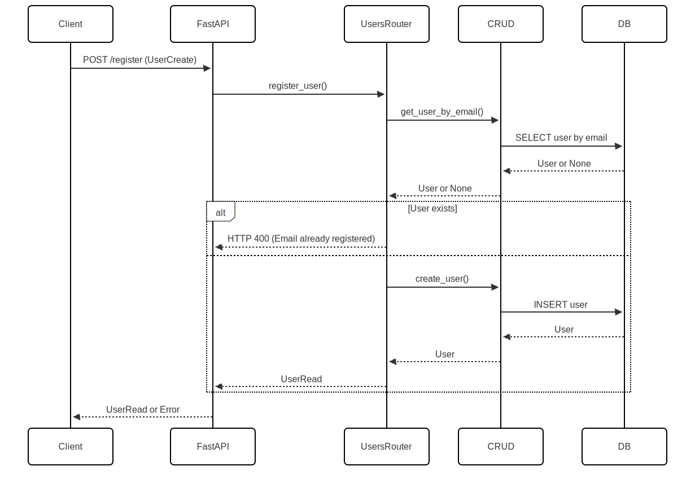
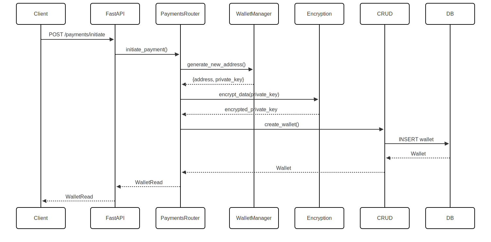
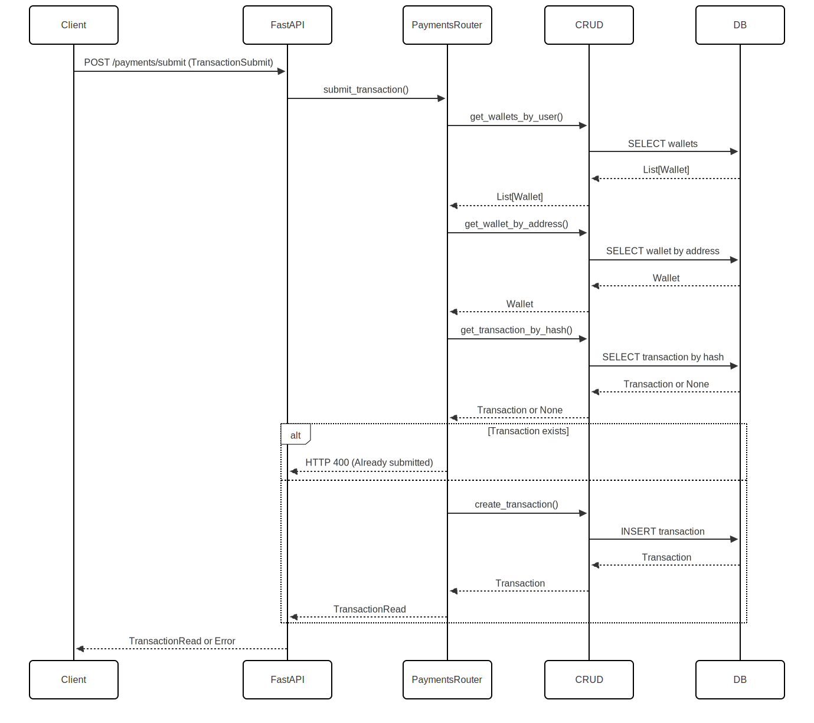
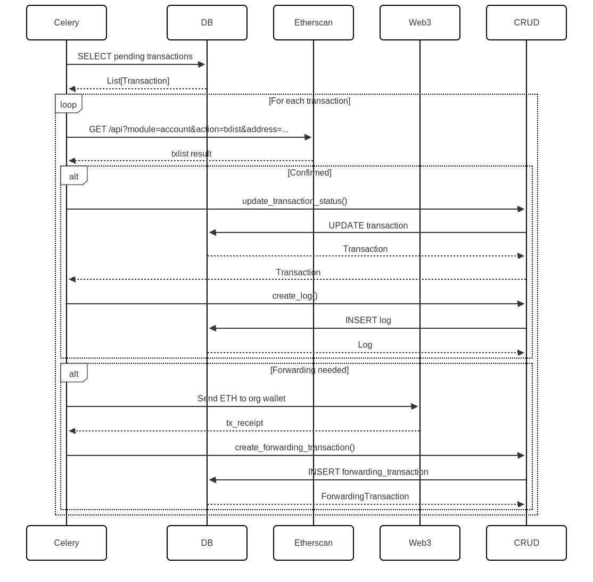

# Crypto Payment System

This project is a Crypto Payment System API built with FastAPI and Etherscan API. It allows creates wallets for users to make transactions to, submit transactions, and monitor transaction statuses.
It only supports Ethereum at the moment. The project uses uv for fast and reliable Python package management.

## Features

- User registration and authentication
- Wallet creation and management
- Transaction submission and monitoring
- Rate limiting to prevent abuse
- CORS support for frontend integration

## Requirements

- Python 3.12+
- PostgreSQL
- Redis
- Docker (for containerized deployment)
- uv (Python package manager)

---

# Architecture Diagrams

## Component Diagram



---

## Sequence Diagrams

### 1. User Registration



---

### 2. Wallet Creation



---

### 3. Transaction Submission



---

### 4. Transaction Monitoring (Celery Task)



---

## Class Diagram


---

## Setup

### Environment Variables

Create a `.env` file in the project root with the following variables:

```
DATABASE_URL=postgresql+asyncpg://user:password@db/crypto_payments
MNEMONIC=your_mnemonic_seed_phrase
CELERY_BROKER_URL=redis://redis:6379/0
CELERY_RESULT_BACKEND=redis://redis:6379/0
ETHERSCAN_API_KEY=your_etherscan_api_key
```

### Docker

To run the project using Docker, use the following commands:

```sh
docker compose up --build
```

This will start the PostgreSQL, Redis, FastAPI, and Celery services. The application runs as a non-root user for security, and uses uv for fast Python package management.

### Manual Setup

1. Install uv (if not already installed):

```sh
curl -LsSf https://astral.sh/uv/install.sh | sh
```

2. Install dependencies using uv:

```sh
uv sync
```

3. Run the FastAPI application:

```sh
uv run uvicorn app.main:app --host 0.0.0.0 --port 8000 --reload
```

4. Start the Celery worker and beat:

```sh
uv run celery -A app.celery_app.celery worker --loglevel=info
uv run celery -A app.celery_app.celery beat --loglevel=info
```

## Usage

### API Endpoints

- `POST /users/`: Register a new user
- `POST /auth/login`: Login and obtain a token
- `POST /payments/initiate`: Initiate a new wallet
- `POST /payments/submit`: Submit a transaction
- `GET /payments/transactions/{transaction_id}`: Get transaction status
- `GET /payments/my-wallets`: Get all wallets for the current user

### Running Tests

To run the tests, use the following command:

```sh
pytest
```

## Contributing

Contributions are welcome! Please open an issue or submit a pull request.

## License

This project is licensed under the MIT License.